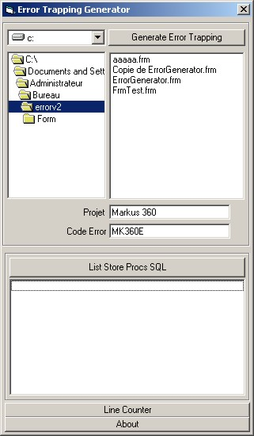



## Error Trapping Generator

### Description

Description

Error Trapping generator

Tasks

Genererate Error Tapping where needed on .Frm .Cls .Bas. Counts lines in your program (Only what you typed) Generate a SQL stored Procedure list (SQL Only)

Special Features : Can select more than one file and it will generate/count/list stored procedures from selected files. It also know when to add or not a error trapping. So if you have 3 error trappings done by hand and you run this program, it will pass those 3 functions/subs and add the error trapping to the others.

A usefull tool I made when you got a lot of error trapping to do. It writes it directly on the selected files does more.

I decided to make it since i made a 35000 code lines program and error trapping was required almost everywhere. So there it is :) I hope you'll give some time for some feedback. Thank you for your time and I hope you will use this quite usefull tool.

I'll make a new version soon for people who make commercial programs with internet connection. My goal is to make a Error trapping generator witch send errors to a server (witch ill make) when errors occur on your developped program.

Enjoy :)
 
### More Info
 

             |
---                |---
**Submitted On**   |2003-05-09 13:12:42
**By**             |[Robert Turcotte](https://github.com/Planet-Source-Code/PSCIndex/blob/master/ByAuthor/robert-turcotte.md)
**Level**          |Advanced
**User Rating**    |5.0 (25 globes from 5 users)
**Compatibility**  |VB 4\.0 \(32\-bit\), VB 5\.0, VB 6\.0
**Category**       |[Coding Standards](https://github.com/Planet-Source-Code/PSCIndex/blob/master/ByCategory/coding-standards__1-43.md)
**World**          |[Visual Basic](https://github.com/Planet-Source-Code/PSCIndex/blob/master/ByWorld/visual-basic.md)
**Archive File**   |[Error\_Trap158561592003\.zip](https://github.com/Planet-Source-Code/robert-turcotte-error-trapping-generator__1-45375/archive/master.zip)

